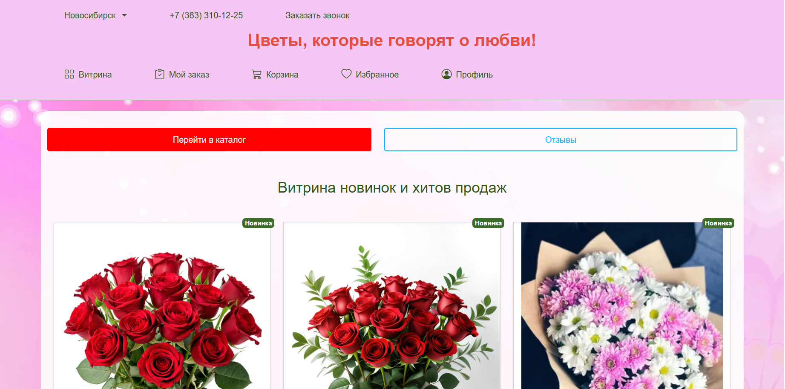
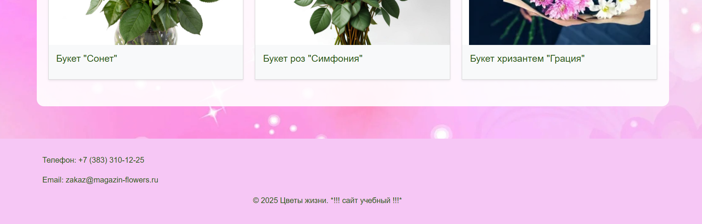

# Web_Flowers_R1_08_06_2025_
Выпускной проект Магазин Цветов с Телеграмм ботом (Группа 9)

# Цветы, которые говорят о любви! - Интернет-магазин цветов  🎉

Веб-приложение для продажи цветов с каталогом товаров, корзиной, заказами и интеграцией с Telegram-ботом.



---

## 📦 Основные функции

- Каталог товаров с фильтрацией по группам, цветам, новинкам, хитам, ценам, названию и наличию
- Избранное для пользователей
- Отзывы и рейтинги к товарам
- Корзина с возможностью изменения количества товаров
- Оформление заказа с выбором даты доставки и адреса
- История заказов с повторным заказом
- Telegram-бот для уведомлений администратора о новом заказе, запросе звонка, отображении всех заказов, выведении аналитических отчетов (статистики по заказам) и управления статусами заказов
- Кастомная модель пользователя с полями: телефон, адрес

---

## 🛠 Технологии

- Backend: Django 4.x
- Database: SQLite (для разработки)
- Дополнительно: 
  - django-filters для фильтрации товаров
  - aiogram для Telegram-бота
  - Pillow для работы с изображениями
  - Bootstrap 5
  - Hypothesis (для тестирования)

---

## 🚀 Установка

1. Клонировать репозиторий:

    ```bash
    git clone https://github.com/yourusername/flower_shop.git
    cd flower_shop
    ```

2. Создать и активировать виртуальное окружение:

    ```bash
    python -m venv venv
    source venv/bin/activate
    ```

3. Установить зависимости:

    ```bash
    pip install -r requirements.txt (aiohttp==3.8.6  установить отдельно)
    ```

4. Настроить окружение (файл .env):

    ```plaintext
    SECRET_KEY_DJANGO=your_django_secret_key
    TELEGRAM_BOT_TOKEN=your_telegram_bot_token
    TELEGRAM_ADMIN_CHAT_IDS=12345,67890  # ID чатов через запятую
    TELEGRAM_ADMIN_CHAT_ID=12345,67890   
   ```

5. Выполнить миграции:

    ```bash
    python manage.py migrate
    ```

6. Создать суперпользователя для администратора:

    ```bash
    python manage.py createsuperuser  
    Имя пользователя: admin
    Адрес электронной почты: admin@admin.com
    Пароль: Leto5678

    ```

7. Запустить сервер:

    ```bash
    python manage.py runserver
    ```

8. Запустить Telegram-бот (отдельный терминал):

    ```bash
    python manage.py runbot [bot.py](flower_shop/bot.py)
    ```

## 🧪 Тестирование

```bash
pytest --cache-clear
coverage html
```

## 🌐 Примеры запросов

- Каталог товаров: `/catalog/`
- Корзина: `/orders/cart/`
- Профиль пользователя: `/users/profile/`
- Админ-панель (для ведения справочника товаров и дополнительной информации о компании, доставке, оплате; внесения изменений в избранное, отзывы, заказы, пользователей): `/admin/`

## 🗂 Структура проекта

```
flower_shop/
├── catalog/            # Приложение каталога
├── orders/             # Приложение заказов
├── users/              # Приложение пользователей
├── analytics/          # Аналитика продаж
├── content/            # Статический контент
├── flower_shop/        # Основные настройки
├── templates/          # HTML шаблоны
├── static/             # Статические файлы
├── bot.py              # Telegram бот
├── tests.py            # Основные тесты
└── manage.py           # Управление проектом
```

## ⚠️ Важно

- Создайте папку `media/products` для загрузки изображений товаров
- Настройте ALLOWED_HOSTS и DEBUG = False, замените SQLite на PostgreSQ, настройте статические файлы, медиа, почту хоста, HTTPS, логирование  в `settings.py` для продакшна (в разработке используется консольный бэкенд)
- Настройте SSL-сертификат для HTTPS

### Для продакшн-среды:

- Уточните .env для БД и почты хоста
- Используйте PostgreSQL/MySQL
- Настройте Nginx + Gunicorn
- Регулярно создавайте бэкапы БД

## Лицензия

License.
